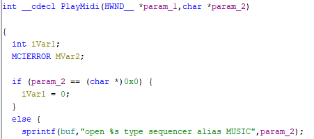
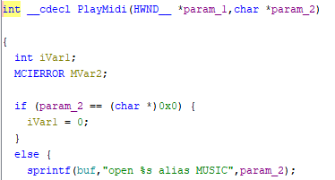
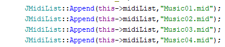
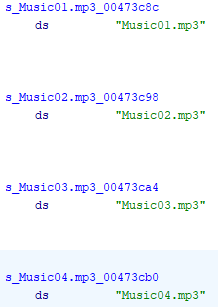
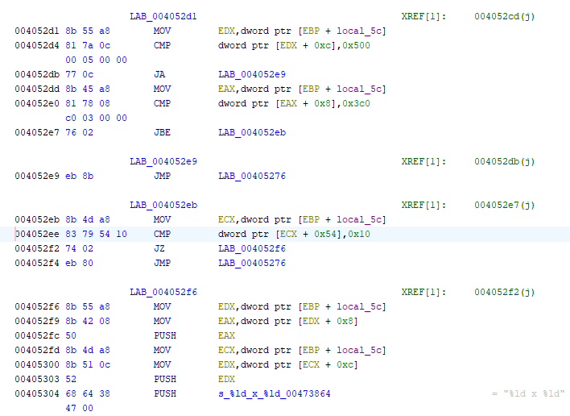
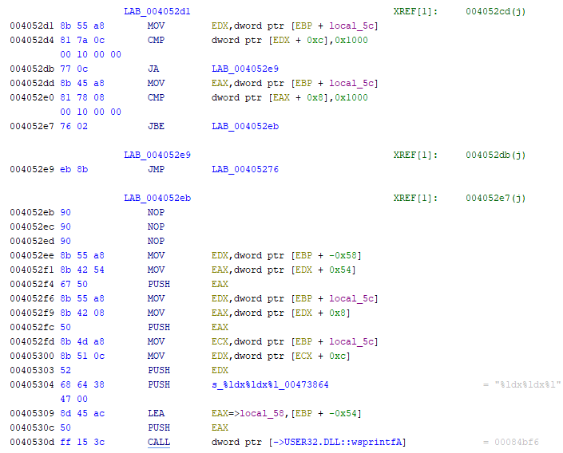
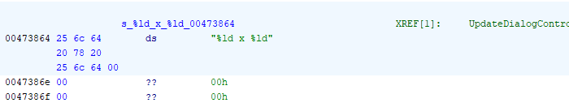

# Łatki do Hopmona 2.0
Te repozytorium zawiera łatki do gry [Hopmon 2.0](http://saitogames.com/hopmon/index.htm) autorstwa Saito Games. Hopmon to starsza gra z 2001 roku, stworzona głównie z myślą DirectX 7. Wykorzystuje muzykę skomponowaną przez T.Kinoshita na Roland SK-88 Pro. Około roku 2020 James Saito udostępnił Hopmona jako freeware, więc każdy może pobrać i zagrać w niego. Niestety mimo, że twórca dostosował grę dla nowszych systemów Windows, to jednak część komponentów nadal sprawia problemy.

Te repozytorium zawiera binarne łatki do pliku wykonywanego Hopmona wykonanie przy użyciu [HDiffPatch](https://github.com/sisong/HDiffPatch). Samo repo zawiera jedynie pliki związane z łatkami. Gotowa paczka łatająca oraz ewentualnie zasoby (muzyka i polskie tekstury) znajdują się w zakładce [Releases](https://github.com/Pieshka/hopmon-patched/releases).

## Przekierowano mnie tutaj z forum XYZ...
Poprzednio te repozytorium wyglądało zupełnie inaczej. Pliki muzyczne dostępne były bezpośrednio w repozytorium przez co bardzo kiepsko integrowały się z gitem (dodatkowo mógł z tego powodu nastąpić copyright strike na całe repo, a nie na jego część). Dołączony był również DDrawCompact, a także binarne pliki z łatkami wykonanymi we własnościowym formacie SVF. Na domiar złego dołączony patcher w formacie bat zawierał payload VBScript, który oczywiście nie był niebezpieczny, ale antywirusy mocno kręciły nosem na niego. Poza tym prawdopodobnie wiele osób wolało by nie uruchamiać pliku batch zawierającego mnóstwo nieczytelnych bajtów.

Z tego powodu postanowiłem przerobić to repo, aby było "copyright friendly", a także żeby całość opierała na otwarto-źródłowych narzędziach zewnętrznych. Dla osób, które wolały by mimo wszystko ręcznie zastosować łatki, opiszę co dokładnie w kodzie zostało zmienione. Zatem bez zbędnego przedłużania, zapraszam do czytania.

## Zmiany w pliku wykonywalnym
Dostępne są trzy (cztery) zestawy łatek:
* `music` - zmienia funkcję `PlayMidi`, żeby zamiast plików sekwencyjnych MIDI, odtwarzała pliki MP3. Wymagane jest aby w katalogu z plikiem .exe znajdowały się pliki `Music01.mp3`, `Music02.mp3`, `Music03.mp3` oraz `Music04.mp3` - dostępne do pobrania w zakładce Releases.
* `resolution` - zwiększa limit rozdzielczości z 1280x960 na 4096x4096. Dodatkowo podstawowa gra wymusza 16-bitową głębię kolorów przez co na nowszych systemach i kartach graficznych Hopmon okropnie klatkował. DDrawCompact to naprawiał ale okazuje się, że po zdjęciu limitu i wybraniu 32-bitowej głębi kolorów, wszystko poprawnie działa bez dodatkowych bibliotek. Zatem patch dodaje możliwość wybrania 32-bitowej głębi kolorów (właściwie to dowolnej głębi kolorów, ale u mnie się wyświetlają tylko 32-bitowa i 16-bitowa).
* `combined` - zawiera powyższe patche w sobie
* `base` - łatka dostępna jedynie w języku polskim, dodaje sam język polski na bazie tłumaczenia wydawnictwa TopWare Interactive z 2002 roku, bez wprowadzania powyższych zmian.

## Sposób instalacji
1. Pobierz [Hopmon 2.0](http://saitogames.com/hopmon/index.htm) i zainstaluj w systemie.
2. Pobierz paczkę `hopmon-patches.zip` z zakładki [Releases](https://github.com/Pieshka/hopmon-patched/releases) i wypakuj gdzieś u siebie na dysku.
3. Skopiuj plik `Hopmon.exe` z zainstalowanej wersji gry do rozpakowanej paczki, tak aby plik `Hopmon.exe` i `start.bat` znajdowały się w jednym katalogu.
4. Uruchom plik `start.bat` (możesz sprawdzić, że nie zawiera żadnych payloadów :>)
5. Postępuj zgodnie z instrukcjami na ekranie. Paczka wymaga aby wersja Hopmona była dokładnie taka sama na jakiej ja generowałem patche - sprawdzi ona ten wymóg samodzielnie.
6. Zostanie wygenerowany plik .exe z `patched` w nazwie. Przekopiuj go do oryginalnego katalogu z Hopmonem i zastąp nim oryginalny `Hopmon.exe`.
7. Jeżeli wybrałeś łatki `music` lub `combined` to pobierz z zakładki [Releases](https://github.com/Pieshka/hopmon-patched/releases) paczkę `hopmon-music.zip` i wypakuj znajdujące się w niej pliki MP3 bezpośrednio do katalogu z grą, tak żeby plik `Hopmon.exe` oraz pliki MP3 były obok siebie. Na tym etapie możesz usunąć pliki `.mid` ponieważ nie będą potrzebne.
8. Wszystkie pobrane pliki zip i paczki można bezpiecznie usunąć.

## Sposób ręcznego przygotowania
Jeżeli nie chcesz korzystać z moich łatek i wolisz przygotować sobie samemu odpowiedni plik wykonywalny, to podążaj za tą sekcją. Jest ona jednak przeznaczona dla osób, które się znają na reverse engineering, więc będę zakładał, że wiesz o co chodzi. Ja tylko wskażę konkretne modyfikacji w kodzie.

### Patch music
Domyślnie funkcja `PlayMidi` korzysta z `mciSendString` do odtwarzania muzyki i wywołuje ją w taki sposób:

Obecność `type sequencer` wymusza traktowanie pliku wejściowego jako sekwencyjnego typu MIDI. Należy wykasować to ze stringa. Zmodyfikowana funkcja powinna wyglądać tak:

Ponadto w `XApplication::Create()` należy zmienić ładowanie ścieżek do plików i podmienić wpisy `.mid` w nazwach plików na `.mp3`:

Po zmodyfikowaniu ścieżki powinny wyglądać tak:

Dzięki tej modyfikacji gra zamiast plików MIDI, będzie odtwarzać pliki MP3. Istnieje również opcja odtwarzania plików WAV. Wystarczy zmienić nazwy z `.mid` na `.wav`.

### Patch resolution
W funkcji `UpdateDialogControls` podczas wypełniania opcji dialogowych pomijane są rozdzielczości większe od 1280x960 oraz głębie bitowe inne niż 16-bit. 

Kod assemblera wygląda jak na poniższym obrazku. Najpierw mamy operacje sprawdzające górną granicę rozdzielczości, a potem operacje sprawdzające głębię bitową.

Możemy całkowicie usunąć sprawdzanie głębi bitowej, a w jej miejsce dołożyć kod, który będzie wyświetlał głębię w menu dialogowym. Czyli zamiast `1920 x 1080` będzie się wyświetlać `1920x1080x32`. Jest to o tyle konieczne, że będą się wyświetlać głębie 16-bitowe i 32-bitowe (a może i inne), więc dobrze by było wiedzieć co i jak. Po zmianie kod wygląda tak:

Przy czym należy też zmienić stringa formatującego który dostarczany jest do funkcji `wsprintfA()`. Domyślnie wygląda on tak:

A my musimy dodać do niego trzecią liczbę w ten sposób:

### Patch PL base
Tłumaczenie binarki na język polski opiera się na podmianie zasobów za pomocą narzędzi typu [Risoh Editor](https://github.com/katahiromz/RisohEditor). Pliki graficzne i okna dialogowe w języku polskim są dostępne w zakładce [Releases](https://github.com/Pieshka/hopmon-patched/releases) w pliku `hopmon-polish-resources.zip`. Pliki mają nazwy, które odpowiadają identyfikatorom zasobów, więc będzie bardzo łatwo je podmienić. Osobiście uważam, że polskie grafiki są brzydkie (szczególnie gratulacje końcowe).

## Credits
* Szczególne podziękowania dla James Saito za stworzenie mojej gry dzieciństwa czyli Hopmona oraz T.Kinoshita za fenomenalny soundtrack!
* Wersje MP3 oryginalnej ścieżki dźwiękowej zostały wygenerowane przez [Tech&Music Extra](https://www.youtube.com/watch?v=G_BOY0J7tlI)
* Patche zostały przygotowane za pomocą oprogramowania [HDiffPatch](https://github.com/sisong/HDiffPatch)
* Polskie zasoby zostały przygotowane przez zespół tłumaczy z wydawnictwa TopWare Poland dla polskiego wydania Hopmona z 2002 roku.

## License
Wszystkie skrypty i łatki (czyli efektycznie całe repozytorium) są dostępne na licencji Unlicense, czyli w domenie publicznej.
Nie dotyczy to paczek udostępnianych w zakładce [Releases](https://github.com/Pieshka/hopmon-patched/releases), które poza moimi łatkami i skryptami, zawierają też zasoby, których prawa autorskie należą do TopWare Poland oraz T.Kinoshita.

**Pamiętaj, że redystrybucja zmodyfikowanych plików binarnych Hopmona jest niezgodne z jego EULA!**
