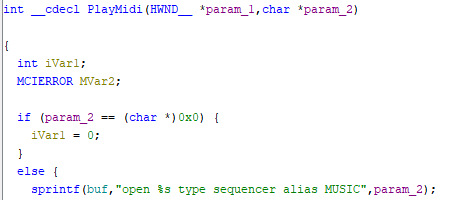
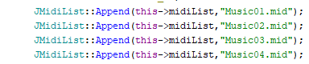
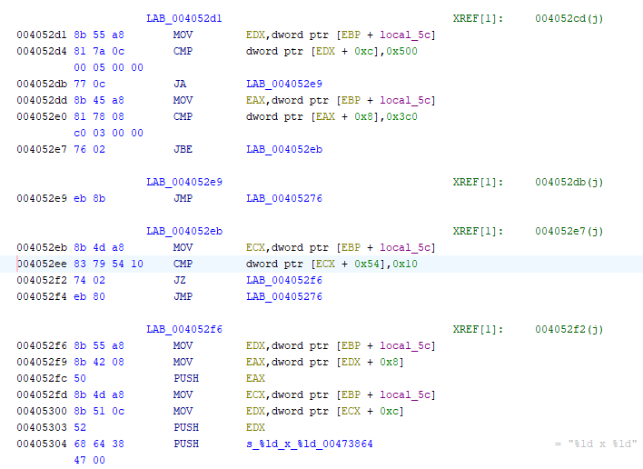

#  Patches  for  Hopmon  2.0

> Polska wersja README dostępna [tutaj](https://github.com/Pieshka/hopmon-patched/README.PL.md)

This repository contains patches for the game [Hopmon 2.0](http://saitogames.com/hopmon/index.htm) by Saito Games. Hopmon is an older game from 2001, created mainly for DirectX 7. It uses music composed by T. Kinoshita on Roland SK-88 Pro. Around 2020, James Saito released Hopmon as freeware, so anyone can download and play it. Unfortunately, even though the developer has adapted the game for newer Windows systems, some components still cause problems.

This repository contains binary patches for the Hopmon executable file created using [HDiffPatch](https://github.com/sisong/HDiffPatch). The repository itself only contains files related to the patches. The ready-made patch package and any resources (music and Polish textures) can be found in the [Releases](https://github.com/Pieshka/hopmon-patched/releases) tab.

##  I  was  redirected  here  from  the  XYZ  forum...
Previously,  this  repository  looked  completely  different.  Music  files  were  available  directly  in  the  repository,  which  made  them  very  difficult  to  integrate  with  Git  (additionally,  this  could  result  in  a  copyright  strike  on  the  entire  repository,  rather  than  just  part  of  it). DDrawCompact was also included, as well as binary files with patches made in the proprietary SVF format. To make matters worse, the included patcher in bat format contained a VBScript payload, which was obviously not dangerous, but antivirus programmes strongly disapproved of it. Besides, many people would probably prefer not to run a batch file containing a lot of unreadable bytes.

For this reason, I decided to rework this repo to make it ‘copyright friendly’ and to base the whole thing on open-source external tools. For those who would still prefer to apply the patches manually, I will describe exactly what has been changed in the code. So, without further ado, I invite you to read on.

## Changes to the executable file
There are three (four) sets of patches available:
* `music` - changes the `PlayMidi` function so that it plays MP3 files instead of MIDI sequence files. The files `Music01.mp3`, `Music02.mp3`, `Music03.mp3` and `Music04.mp3` must be present in the directory containing the .exe file - available for download in the Releases tab.
* `resolution` - increases the resolution limit from 1280x960 to 4096x4096. In  addition,  the  basic  game  enforces  16-bit  colour  depth,  which  caused  Hopmon  to  stutter  terribly  on  newer  systems  and  graphics  cards.  DDrawCompact  fixed  this,  but  it  turns  out  that  after  removing  the  limit  and  selecting  32-bit  colour  depth,  everything  works  correctly  without  additional  libraries. So the patch adds the ability to select 32-bit colour depth (actually any colour depth, but for me only 32-bit and 16-bit are displayed).
* `combined` - contains the above patches
* `base` - patch available only in Polish, adds the Polish language based on the 2002 translation by TopWare Interactive, without introducing the above changes.

##  Installation  instructions
1.  Download  [Hopmon  2.0](http://saitogames.com/hopmon/index.htm)  and  install  it  on  your  system.
2. Download the `hopmon-patches.zip` package from the [Releases](https://github.com/Pieshka/hopmon-patched/releases) tab and extract it somewhere on your hard drive.
3. Copy the `Hopmon.exe` file from the installed version of the game to the unzipped package so that the `Hopmon.exe` and `start.bat` files are in the same directory.
4. Run the `start.bat` file (you can check that it does not contain any payloads :>)
5. Follow the instructions on the screen. The package requires that the version of Hopmon be exactly the same as the one I used to generate the patches - it will check this requirement itself.
6. An .exe file with `patched` in its name will be generated. Copy it to the original Hopmon directory and replace the original `Hopmon.exe` with it.
7. If you chose the `music` or `combined` patches, download the `hopmon-music.zip` package from the [Releases](https://github.com/Pieshka/hopmon-patched/releases) tab and extract the MP3 files it contains directly to the game directory so that the `Hopmon.exe` file and the MP3 files are next to each other. At this stage, you can delete the `.mid` files as they will not be needed.
8. All downloaded zip files and packages can be safely deleted.

##  Manual  preparation  method
If  you  don't  want  to  use  my  patches  and  prefer  to  prepare  the  appropriate  executable  file  yourself,  follow  this  section.  However,  it  is  intended  for  people  who  are  familiar  with  reverse  engineering,  so  I  will  assume  that  you  know  what  it  is  about.  I  will  only  point  out  specific  modifications  in  the  code.

### Music patch
By default, the `PlayMidi` function uses `mciSendString` to play music and calls it like this:

The presence of `type sequencer` forces the input file to be treated as a sequential MIDI type. This should be deleted from the string. The modified function should look like this:

In addition, in `XApplication::Create()`, change the loading of paths to files and replace `.mid` entries in file names with `.mp3`:

After modification, the paths should look like this:

Thanks to this modification, the game will play MP3 files instead of MIDI files. There is also an option to play WAV files. Just change the names from `.mid` to `.wav`.

### Resolution patch
In the `UpdateDialogControls` function, resolutions greater than 1280x960 and bit depths other than 16-bit are ignored when filling in dialogue options.

The assembler code looks like the image below. First, we have operations that check the upper limit of the resolution, followed by operations that check the bit depth.

We can completely remove the bit depth check and replace it with code that will display the depth in the dialogue menu. So instead of `1920 x 1080`, `1920x1080x32` will be displayed. This is necessary because 16-bit and 32-bit depths (and maybe others) will be displayed, so it would be good to know what and how. After the change, the code looks like this:

You also need to change the formatting string that is passed to the `wsprintfA()` function. By default, it looks like this:

And we need to add a third number to it like this:

###  Polish base patch
The  translation  of  the  binary  into  Polish  is  based  on  replacing  resources  using  tools  such  as  [Risoh  Editor](https://github.com/katahiromz/RisohEditor).  Image  files  and  dialogue  boxes  in  Polish  are  available  in  the [Releases](https://github.com/Pieshka/hopmon-patched/releases) tab in the `hopmon-polish-resources.zip` file. The files have names that correspond to resource identifiers, so it will be very easy to replace them. Personally, I think the Polish images are ugly (especially the final congratulations).

## Credits
* Special thanks to James Saito for creating my childhood game Hopmon, and to T. Kinoshita for the phenomenal soundtrack!
*  MP3  versions  of  the  original  soundtrack  were  generated  by  [Tech&Music  Extra](https://www.youtube.com/watch?v=G_BOY0J7tlI)
*  Patches  were  prepared  using  [HDiffPatch](https://github.com/sisong/HDiffPatch)  software
* Polish resources were prepared by a team of translators from TopWare Poland for the Polish release of Hopmon in 2002.

## License
All scripts and patches (i.e. the entire repository) are available under the Unlicense, i.e. in the public domain.
This does not apply to the packages available in the [Releases](https://github.com/Pieshka/hopmon-patched/releases) tab, which, in addition to my patches and scripts, also contain resources copyrighted by TopWare Poland and T. Kinoshita.

**Please note that redistribution of modified Hopmon binaries is not permitted under its EULA!**
